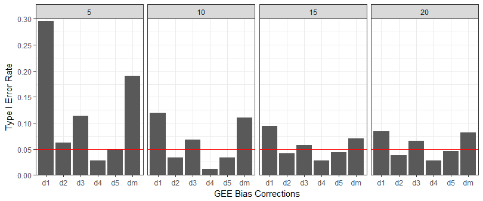

```{r setup, include=FALSE}
knitr::opts_chunk$set(echo = TRUE)
```

This tutorial accompanies the paper *Between-litter variation in developmental studies of hormones and behavior: inflated false positives and diminished power*. This tutorial can address all recommendations provided in the manuscript. This tutorial is not meant to thoroughly cover the topic of analyzing dependent measures. Background information can be obtained from the reference section of the paper.

I cannot provide recommendations for reporting results. I use Bayesian methods in applied settings, so do not have the 
expertise in reporting classical (those that include *p*-values, test statistics, etc.) methods.I do, however, examine the 
statistical properties of classical methods often.

I begin each section by providing techniques to obtain the necessary information directly from the fitted models. The aim here is to show the "inner workings" of the methods. I end section with a convenience function that is included in the litterEffects package.

The tutorial is organized as follows:

1. Data Analysis
    * Multilevel Model (MLM)
          * Two Group Comparison
          * Effect Size for the Treatment Effect
          * Total Variance Explained by Litter
          * Significance Testing of the Litter Effect
          * Between-litter Variance Explained by the Treatment Effect
    * Generalized Estimating Equation (GEE)
          * Two Group Comparison
    * Litter Means
          * Two Group Comparison
2. Prospective Power
    * MLM
          * Treatment Effect
          * Litter Effect
    * GEE
    * Litter Means
3. Retrospective Power
    * MLM
          * Treatment Effect
4. False Positive Rates
    *  *t*-test
5. Bias Correction: GEE

Install the following packages:
```{r eval = FALSE, echo = TRUE, error = TRUE}
install.packages("ggplot2")
install.packages("dplyr")
install.packages("lmerTest")
install.packages("effsize")
install.packages(devtools::install_github("donaldRwilliams/litterEffects")))
```
Load the following packages:
```{r eval = TRUE, echo = TRUE, message=FALSE}
# load the following package
library("ggplot2")
library("dplyr")
library("lmerTest")
library("effsize")
library("litterEffects")
```
# 1. Data Analysis
Load the example data set:
```{r echo = T, eval = TRUE}
# data included in the litter effects package
my_data <- litterEffects::my_data

```{r, eval=FALSE}
# to load your own data
# (ensure the csv file is in the working directory)
my_data <- read.csv("your_data.csv")
```{r eval = FALSE}
# view the structur of the data
my_data
``` 
## Multilevel Model
#### Two Group Comparison

This first model (mlm_one) investigates the treatment effect between two groups. We use "treatment", but this is simply a comparison between two groups (stress vs control; high vs low LG; etc.). We also include a *t*-test (t_one) for comparison. While the results may appear similar, please note the *p*-values from each method: e.g., 5 one-hundredths of a decimal place is the difference between *p* = 0.04 and *p* = 0.09. 

Some reading the paper may think fitting a MLM is difficult. It is not, but understanding the models may take some time and reading. There is not much difference in specifying each model (MLM vs. *t*-test) in R. The MLM requires the addition of + (1|litter). This is the random effect (intercept) for litter.
```{r} 
mlm_one <- lmerTest::lmer(y ~ treat + (1|litter), data = my_data)
```{r eval=TRUE}
# Random effect block provides the variance estimates
summary(mlm_one)
```{r eval=FALSE}
# compare to t-test (assuming equal variances)
t_one  <- lm(y ~ treat, data = my_data)
summary(t_one)
```
#### Effect Size for the Treatment Effect
Compute delta total variance (standardized effect) \(\delta_{t}\) as:
```{r}
#extract variances from MLM model. This function (VarCorr) extracts
#the variances from the fitted models. We put them into a data frame
#so that we can more easily compute the ICC of litter.
est <- summary(mlm_one)$coefficients[[2]]
# extract variances
var     <- as.data.frame(lme4::VarCorr(mlm_one,comp="Variance"))
# compute delta total variance
delta_t <- est / sqrt(var$vcov[1] + var$vcov[2])
delta_t

# function from the litterEffect package
litterEffects::delta_t(y ~ treat + (1|litter), data = my_data)
```
#### Total Variance Explianed by Litter (ICC)

The paper placed great emphasis on between-litter variance. The total variance explained by litter can be computed as:
```{r}
mlm_var <- as.data.frame(lme4::VarCorr(mlm_one,comp="Variance"))

icc_by_hand <- mlm_var$vcov[1] / (mlm_var$vcov[1] + mlm_var$vcov[2])
icc_by_hand

# function from the litterEffect package
litterEffects::litter_icc(y ~ treat + (1|litter), data = my_data)
```
#### Significance Testing of the Litter Effect

I do not recommend testing the significance of random effects, especially in this situation. This is commonly done, however, so I provide an example here. Please note that, regardless of statistical significance, the random effect of litter must be in the model to ensure the assumption of independence is not violated.
```{r} 
mlm_two <- lmerTest::lmer(y ~ treat + (1|litter), data = my_data)
#compute significance 
lmerTest::rand(mlm_two)
```
#### Between-litter Variance Explained by the Treatment Effect

MLM is a flexible method that allows for answering many research question. One could investigate whether the treatment effect explains between-litter variance. This would be especially important for the natural variations in maternal care literature, because there is an explicit interest in whether pups from the same dam are similar to one another. I see this as less relevant to pre-natal stress literature, although the same model can be applied there as well.
```{r}
# begin by fitting the intercept only model.
mlm_three <- lmerTest::lmer(y  ~ 1 + (1|litter), data = my_data)
# now include the treatment effect
mlm_four <- lmerTest::lmer(y  ~ treat + (1|litter), data = my_data)

# we now assess how much litter variance was explained by the treatment effect
mlm_three_var <- as.data.frame(lme4::VarCorr(mlm_three),comp="Variance")
mlm_four_var  <- as.data.frame(lme4::VarCorr(mlm_four),comp="Variance")

(mlm_three_var$vcov[1] - mlm_four_var$vcov[2])/ mlm_three_var$vcov[1] 

# conviencence function from the litterEffects package
outcome <- my_data$y
treatment <- my_data$treat
litter <- my_data$litter
litterEffects::litter_var_explained_by_treat(outcome = outcome, 
                                             treatment = treatment,
                                             litter = litter)
```
## Generalized Estimating Equation
#### Two Group Comparison

Here I demonstrate a generalized estimating equation. Importantly, this method require a bias correction for small sample size. I have 
provided reference in the litterEffects package (bias_correction function). To determine the optimal correction (for the standard error), we need to specify the experimental design (e.g., number of litter, etc.).
```{r message = FALSE}
# this will take some time. A few warnings may arise. 
# If there is a large number for nsim, a few warning
# is probably not problematic for this purpose.
data_gee <- litterEffects::data_generator(b_0 = 5, b_treat = 3, icc = 0.5,
                                          v_overall = 10, n_litters = 10, 
                                          pups_litter = 2)
```{r eval=FALSE}
litterEffects::bias_correction(nsim = 500, icc = 0.5, v_overall = 10, 
                               n_litters = 10, pups_litter = 2)
```{r eval=FALSE}
# check with different icc value
litterEffects::bias_correction(nsim = 500, icc = 0, v_overall = 10, 
                               n_litters = 10, pups_litter = 2)
# With this experimental design, correction d5 is 
# consistently around 0.05. This is the correction 
# we used in the manuscript. Details about these 
# corrections can be found in the litterEffects package
```
With the bias correction selected, the model is fitted as:
```{r}
gee_one <- gee::gee(y ~ treat, id = litter, data = data_gee, 
                    family = gaussian, corstr = "exchangeable",
                    silent = TRUE)
# obtain z-value
z <- summary(gee_one)[[7]][10]
# convert to p-value
p_default   <- 2*pnorm(-abs(z))

# apply bias correction for optimal SE (thus p-value)    
saws_gee  <- saws::geeUOmega(gee_one)
corrected <- saws::saws(saws_gee, method = "d5")
p_corrected <- corrected[[9]][[2]]
```{r, eval = FALSE} 
# compare summary results
summary(gee_one)
corrected
```{r, eval = TRUE}
# compare p-values
p_default
p_corrected
```
## Litter Means
#### Two Group Comparison
The final method compares litter means. This approach averages within litter observations and analyzes them with a *t*-test. As such, each litter contributes only one observation to the analysis.
```{r}
# %>% is the piping function from the package dplyr 
data_means <-  my_data %>% 
               group_by(litter, treat) %>% 
               summarise(y = mean(y))
```{r eval=FALSE} 
# look at data
data_means
# assuning equal variances
mean_lm <- lm(y ~ treat, data_means)
summary(mean_lm)

# assuming unequal variances
mean_t <- t.test(y ~ treat, data_means)
summary(mean_lm)

# effect size
d <- effsize::cohen.d(y ~ treat, data_means)
d
```
This concludes the data analysis section. As stated in the paper, MLMs provide far rich information for inference. This can be clearly seen in this tutorial. If using a GEE or analyzing litter means with a *t*-test, one can only compare groups. These methods cannot provide estimates of between-litter variance or the amount of litter variance explained by the treatment effect. The former (estimates of between-litter variance) is critical for computing prospective power analyses.

# 2. Prospective Power
The litterEffect package allows for assessing power to detect a treatment effect (difference between two group). Delta total 
variance \(\delta_{t}\) is on Cohen's *d* scale: small = 0.20; medium = 0.50; large = 0.80. I recommend > 1,000 iterations for nsims, although multiple runs with smaller values can build an intuition for expected power. 

## Multilevel Model
#### Treatment Effect

```{r eval=FALSE}
# power for large effect with little between-litter variance
litterEffects::prospective_power(nsims =  200, delta_t = 0.80, icc = .10, 
                                 v_overall = 10,n_litters = 12, pups_litter = 2, 
                                 method = "MLM", parameter = "treatment")

# power for large effect with a high amount of between-litter variance
litterEffects::prospective_power(nsims =  200, delta_t = 0.80, icc = .80, 
                                 v_overall = 10, n_litters = 12, pups_litter = 2, 
                                 method = "MLM", parameter = "treatment")
```
#### Litter Effect
The power to detect a litter effect is related to the icc value and the sample sizes (for n_litter and pups_litter).
```{r eval=FALSE}
# power to detect litter effect, when litter explained 10 % of the total variance
litterEffects::prospective_power(nsims =  200, delta_t = 0.80, icc = .10, 
                                 v_overall = 10, n_litters = 12, pups_litter = 2, 
                                 method = "MLM", parameter = "litter")

# power to detect litter effect when litter explains 60 % of the total variance
litterEffects::prospective_power(nsims =  200, delta_t = 0.80, icc = .60, 
                                 v_overall = 10, n_litters = 12, pups_litter = 2, 
                                 method = "MLM", parameter = "litter")
```
I re-emphasize (section *4.2. Conditional false positives* of the paper) that significance testing cannot provide evidence for zero dependencies in the data. A non-significant effect should not be confused with NO litter effect, or that the litter effect is negligible and can thus be excluded. The assumption of independent observations has nothing to do with null hypothesis significance testing. Of course, if power was very high, then one could more reliably detect very small amount of between-litter variance. This is not the case in behavioral neuroendocrinology, so even large amounts of between-litter variance can go undetected and this is where false positive rates are particularly high.

## Generalized Estimating Equation
#### Treatment Effect
The same function (prospective_power) can be used to compute power for a GEE.
```{r eval = FALSE}
litterEffects::prospective_power(nsims =  200, delta_t = 0.80, icc = .10, 
                                 v_overall = 10, n_litters = 12, pups_litter = 2, 
                                 method = "GEE", correction = "d5")

```
## Litter Means
#### Treatment Effect
The same function (prospective_power) can be used to compute power for when analyzing litter means.
```{r eval = FALSE}
litterEffects::prospective_power(nsims =  200, delta_t = 0.80, icc = .10, 
                                 v_overall = 10, n_litters = 12, pups_litter = 2, 
                                 method = "LM", correction = "d5")
```
# 2. Retrospective Power
## Multilevel Model
#### Treatment Effect

Here I provide an example of retrospective power. That is, given a study is completed, what was the power for the observed parameters. Please note that retrospective power is often criticized, especially when used as the reason that a finding was not 
significant. I make no recommendation here, but view retrospective power as yet another tool to learn about the data and
statistics. Of course, the observed values are not the *true* values (if such a thing exists) and may not be representative of the substantive effect of interest.
```{r eval = FALSE}
outcome   <- my_data$y
treatment <- my_data$treat
litter    <- my_data$litter

retrospective_power(nsims = 200, outcome = outcome, 
                    treatment = treatment, 
                    litter = litter)
```
#4. False Positive Rates
##   *t*-test

This section simulates false positive rates using a *t*-test. Of interest is the ICC value. When observations are independent (icc = 0), the error rate will be close to 0.05 (the default alpha level in the litterEffects package). However, increasing the ICC value inflates false positives.

```{r eval = FALSE}
#number of iterations
nsims <- 1000
#matrix to store results
mat <- matrix(nrow = nsims)

type_one <- function(nsims){
    # create nsims data frames
    dat <- lapply(1:nsims, function(x) 
    litterEffects::data_generator(b_0 = 5, b_treat = 0, icc = .9, 
    v_overall = 10, n_litters = 12, pups_litter = 4))
    # loop through list of data frames
    for(i in 1:length(dat)){
    temp_dat <- dat[[i]]
    mat[i,1] <- t.test(y ~ treat, data = temp_dat)$p.value
    }
    # return type one error rate
    list(type_one_t_test =  mean(mat[,1] < 0.05))
}
```
#4. Bias Correction: Generalized Estimating Equation 
I demonstrate the many *p*-values that can be obtained with a GEE model. After realizing this, I was reluctant to include GEE in the paper, but did for three reasons: 1) GEE can be used with thoughtfulness; 2) MLM has many assumptions that GEE does not (e.g., correlation between levels); and 3) it is important to describe many methods, as maybe others will find them more useful than myself. Additionally, this highlights the complexity for estimating clustered data (even for a "simple" two group comparison). 
```{r eval=FALSE}
# number of litters (5, 10, 15, 20)
n_lit <- seq(5, 20, 5)

# matrix to store results
mat <- matrix(ncol = 6, nrow = length(n_lit))

# simulaton
for(j in 1:length(n_lit)){
  lit <- n_lit[j] 
  mat[j, 1:6] <- bias_correction(nsim = 500, 
                                 icc = 0.5, v_overall = 10, 
                                 n_litters = lit , 
                                 pups_litter = 4)[1:6]
}

# combine into data frame
res_df <- as.data.table(cbind(n_lit, mat))

# name columns
# Correction "d1" is the default in the gee package.

colnames(res_df) <- c("n_litters", "d1", "d2", 
                      "d3", "d4", "d5", "dm")

# melt data frame for plotting
mlt <- melt(res_df, id.vars = "n_litters")

mlt %>% ggplot(aes(x = factor(variable), y = value)) +
         geom_bar(stat = "identity") +
         facet_grid(~ n_litters) +
         theme_bw() +
         scale_y_continuous(expand = c(0, 0), 
                            limits = c(0, 0.30),
                            breaks = seq(0, .30, 0.05)) +
         ylab("Type I Error Rate") + 
         xlab("GEE Bias Corrections") +
         geom_hline(yintercept = 0.05, col = "red")
```



